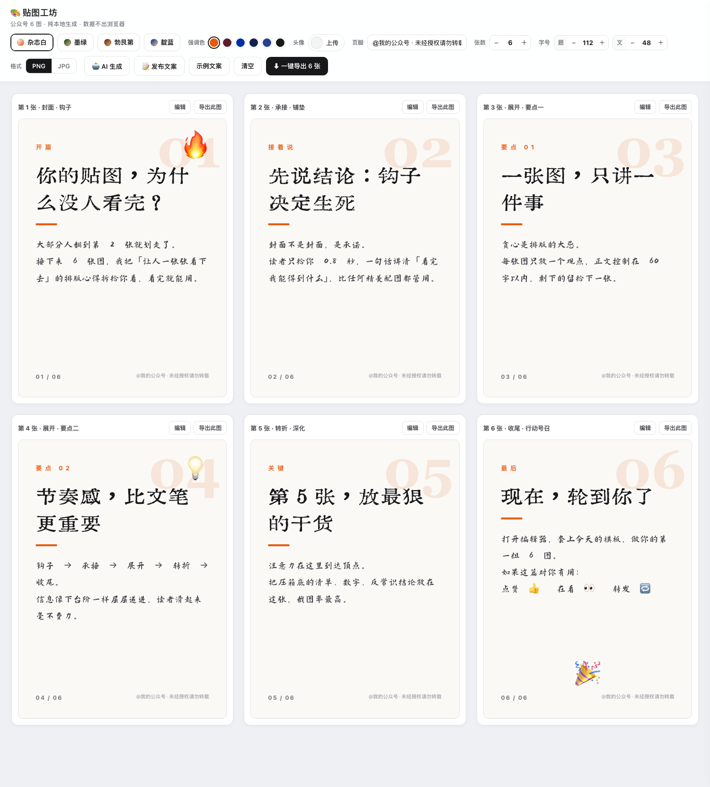

# 🎨 贴图工坊 · 公众号 6 图生成器

纯本地运行的网页小工具：在浏览器里为微信公众号图文生成一组 **6 张连贯贴图**
（封面钩子 → 承接 → 展开 → 转折 → 收尾），支持 3 套模板、文字、表情贴纸、
表情包图片、自定义背景、公众号头像，**接入 DeepSeek 一键把长文拆成 6 图文案**，
一键导出 PNG / JPG。无需服务器、无需联网（调 AI 除外）、数据不出浏览器。



## 快速开始

1. **直接双击 `index.html`**，用 Chrome / Edge / Safari 打开即可。
2. 首次打开已内置一组示例文案，可直接体验「一键导出 6 张」。
3. 点某张卡的 **编辑**（或直接点预览图）修改文案、加表情、传背景。
4. 顶栏可 **上传公众号头像**：圆形显示在每张卡片页脚名称的正上方，一键应用到全部 6 张。
5. 在预览图上 **直接拖动贴纸** 调整位置；单击贴纸可在右侧面板调整大小 / 删除。
6. 顶部切换 **模板** 与 **强调色**，改 **页脚** 署名，选 **PNG / JPG** 格式。
7. 点 **⬇ 一键导出 6 张**：浏览器第一次会询问「允许下载多个文件」，选允许即可。
   单张可用每张卡右上角的 **导出此图**。

## 🤖 AI 自动生成（DeepSeek）

点顶栏「🤖 AI 生成」，把一段素材（文章 / 笔记 / 大纲）整段粘贴进去：

- **在线流程**：填入 DeepSeek API Key（[platform.deepseek.com](https://platform.deepseek.com) 申请，
  仅保存在本机浏览器，请求只发往 `api.deepseek.com`）→ 选模型（默认 `deepseek-flash`，便宜够用；
  可换 `deepseek-v4-pro`，或勾选「深度思考」提升质量）→ 在弹窗里设置**生成张数（1~6，与顶栏联动）** →
  一键生成：**贴图文案 + 发布标题（≤20 字）+ 正文（≤1000 字）+ 话题标签** → 检查/微调 JSON → 应用到卡片。
- **离线流程（不用 API）**：点「📋 复制规范提示词」→ 粘贴给任意 AI（DeepSeek 网页版、
  Kimi、ZCode、Codex…）→ 把它输出的 JSON 贴回 ③ 号框或「从 JSON 文件导入」→ 应用。
  规范详见 [SPEC.md](SPEC.md)，按它即可给 ZCode / Codex 沉淀出生成贴图文案的技能。
- **往返编辑**：「📤 复制当前文案 JSON」可随时导出当前文案，改完再应用回来。
- 应用 JSON 只覆盖**文字与张数**，已加的贴纸、背景、头像全部保留——AI 负责内容，你负责审美；
  **页脚署名（顶栏设置）不会被 AI/JSON 覆盖**，设置一次即可。
- **张数联动**：AI 会按顶栏「张数」生成对应张数（1~6）；若模型两次都不按要求输出，
  会自动纠偏重试，仍不符时按实际张数应用并提示。

## 📝 发布文案与张数

- 顶栏「**张数**」步进器可在 **1~6 张**之间随意调整：预览、编号（01 / 0N）、导出张数全部联动，
  叙事角色也会自动适配（首张封面钩子、末张收尾号召）；
- 顶栏「**字号**」步进器可分别调整**标题**（72~160px）与**正文**（32~72px）的字号，
  四套模板即时生效并随工程保存；
- 顶栏「**📝 发布文案**」面板集中管理发图文要用的文字：**标题（≤20 字）、正文（≤1000 字）、
  话题标签**（自动加井号），各自一键复制，也有「📋 一键复制全部」；
  上限即公众号平台约束，只是天花板，不必写满；内容随工程自动保存。

## 字体（免费商用）

卡片文字使用两款免费商用字体，已内置在 `fonts/` 目录，打开即用、无需安装：

| 用途 | 字体 | 风格 | 来源 |
|------|------|------|------|
| 标题 | 中华薪火体（SinoTorch） | 铅印复古宋，源自抗战时期报刊印刷字体 | 新华社 × 蓝色共鸣，[100font 帖](https://www.100font.com/thread-1541.htm) |
| 正文 | 演示秋鸿楷（Slideqiuhong） | 楷书书法 | 字稿 叶运鹏 / 制作 人生哥，[100font 帖](https://www.100font.com/thread-154.htm) |

- 两款字体均为**个人和企业免费商用**；限制：不可修改/制作衍生版本、不可用于商标、不可转售或嵌入分发。
- 字体在浏览器本地加载（`js/app.js` 里的 FontFace API）；若加载失败会自动回退系统字体，不影响使用。
- 授权原文见 `fonts/LICENSE-SinoTorch-中华薪火体.txt`；两款字体的介绍页均在 100font.com。

## 内置模板

| 模板 | 风格 | 说明 |
|------|------|------|
| 杂志白 | 简洁正式 | 米白纸面 + 大标题 + 巨大底纹序号；强调色含克莱因蓝 / 海军蓝 / 靛青 / 牛血红 |
| 墨绿 | 深色书卷 | 英国赛车绿 / 森林墨绿 / 帝王绿封面 + 香槟金点缀 + 象牙白衬线标题 |
| 勃艮第 | 深色酒标 | 勃艮第红 / 牛血红 / 深酒红封面 + 复古金点缀 + 象牙白黑体标题 |
| 靛蓝 | 深色画廊 | 克莱因蓝 / 海军蓝 / 靛青 / 普鲁士蓝封面 + 雾金点缀 + 象牙白衬线标题 |

> 墨绿 / 勃艮第 / 靛蓝为深色封面模板：顶栏的「背景色」色板可在同色系深浅间切换，字体颜色自动适配为象牙白。

## 6 张卡的叙事节奏

| 张数 | 角色 | 建议内容 |
|------|------|----------|
| 1 | 封面 · 钩子 | 一句话勾住注意力，让人想往下看 |
| 2 | 承接 · 铺垫 | 接住封面，把背景或问题讲清楚 |
| 3 | 展开 · 要点一 | 抛出第一个核心观点 |
| 4 | 展开 · 要点二 | 第二个观点，或情绪推进 |
| 5 | 转折 · 深化 | 反转或更进一步，制造记忆点 |
| 6 | 收尾 · 行动号召 | 总结 + 引导点赞在看关注 |

## 导出说明

- 卡片设计尺寸 **1080 × 1440（3:4）**，导出 PNG / JPG（质量 0.92），符合公众号图片规格。
- 导出通过本地 `html2canvas` 完成，上传的图片会被转成 dataURL 内嵌，
  **不会发起任何网络请求**。
- 连续导出 6 张时每张间隔约 0.45 秒，若浏览器询问「允许下载多个文件」请选择允许。

## 数据保存

- 所有内容（文案、贴纸位置、页脚等）**自动保存**在浏览器 `localStorage`。
- 换浏览器、清缓存会丢失；**导出成图片才是真正的存档**。
- 上传的图片过大导致存储超限时，会自动降级为只保存文字，并弹出提示。

## 目录结构

```
wechat-card-studio/
├── index.html              # 页面入口（双击打开）
├── css/style.css           # 全部样式（含 3 套模板的卡片样式）
├── js/templates.js         # 模板定义（想加模板从这里扩展）
├── js/ai.js                # AI 模块：文案规范、DeepSeek 调用、JSON 解析
├── js/app.js               # 主逻辑：状态、渲染、拖拽、编辑、导出
├── vendor/html2canvas.min.js  # 本地导出库 v1.4.1
├── SPEC.md                 # 贴图文案规范（给 AI 工具/沉淀技能用）
└── README.md
```

## 想改/想加模板？

打开 `js/templates.js`，照着现有模板加一个对象即可：

- `cardBg(i)`：第 i 张卡的背景色或 CSS 渐变；
- `content(card, ctx)`：卡片内容层 HTML，`card` 里有 `kicker / title / body`，
  `ctx` 里有 `num`（第几张）、`indexStr`（“01”）、`role`（角色信息）；
- 再去 `css/style.css` 里为 `t-你的模板名` 写内容层样式（画布 1080×1440）。

想改画布尺寸：改 `js/app.js` 顶部的 `CARD_W / CARD_H` 和 `css/style.css` 里的 `.wx-card` 宽高。
